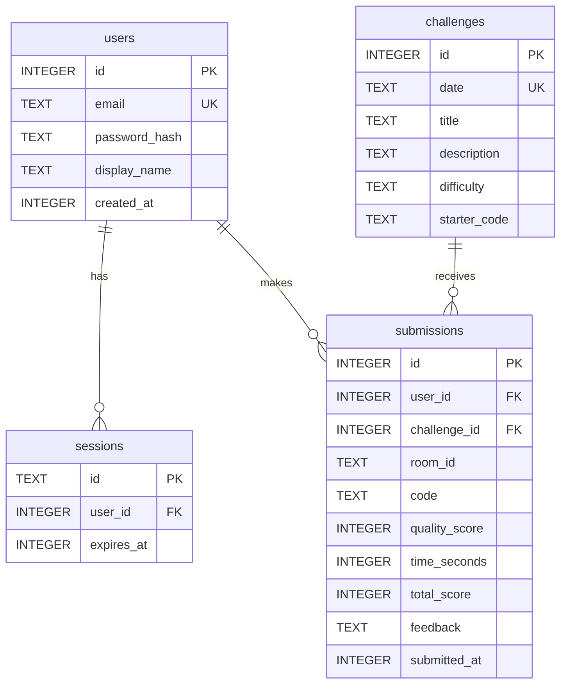

# feat: Learning Platform Pivot

## Overview

Transform the existing real-time collaborative code editor into a coding learning platform. Users authenticate with email + password, receive an AI-generated daily coding challenge, work on it solo or with a teammate in a shared room, get Claude-powered hints on demand via `@ai` in chat, submit their solution for AI evaluation, and are ranked on a per-challenge leaderboard by a combined quality + speed score.

The existing room / buffer / chat / WebSocket architecture is preserved and extended — not replaced. The pivot adds vertical layers (auth, persistence, AI) on top of what already works. (see brainstorm: docs/brainstorms/2026-06-08-learning-platform-brainstorm.md)

---

## Data Model (ERD)



---

## New File Structure

```
server.js                       ← modified: add HTTP routes + WS auth
db.js                           ← new: better-sqlite3 setup + migration runner
auth.js                         ← new: session helpers, authenticate()
claude.js                       ← new: hint + evaluator + challenge generator
cron.js                         ← new: node-cron daily challenge job
db/
  migrations/
    001_users.sql
    002_sessions.sql
    003_challenges.sql
    004_submissions.sql
public/
  index.html                    ← modified: login form, submit + leaderboard buttons
  client.js                     ← modified: login flow, submit, leaderboard panel
  style.css                     ← modified: login form, leaderboard styles
  bundle.js                     ← generated (unchanged)
.env                            ← new: ANTHROPIC_API_KEY
```

---

## Technical Approach

### Phase 1 — Database + Auth

**New packages:**
```bash
npm install argon2 cookie better-sqlite3 dotenv
```

- `argon2` — Argon2id password hashing, OWASP 2026 top recommendation over bcrypt; memory-hard so GPU cracking is expensive. Requires `node-gyp` (C compiler). Fallback: `bcryptjs` (pure JS, `npm install bcryptjs`) if native build fails.
- `better-sqlite3` — synchronous SQLite driver, fastest available (1.1–1.7× faster than the new `node:sqlite` built-in as of mid-2026). Also requires `node-gyp`. No pure-JS fallback; alternative is Node 22+ built-in `node:sqlite` if native compilation is unavailable.
- `cookie` — minimal cookie parse/serialize for raw Node.js `http.IncomingMessage`, no framework needed.
- `dotenv` — loads `.env` into `process.env` at startup. Add `require('dotenv').config()` as the first line of `server.js`. Node.js does not read `.env` files automatically.

**⚠️ Windows setup note:** `argon2` and `better-sqlite3` both require native C++ compilation via `node-gyp`. On Windows, install [Visual Studio Build Tools](https://visualstudio.microsoft.com/downloads/#build-tools-for-visual-studio-2022) with the "Desktop development with C++" workload before running `npm install`. Run `npm install --loglevel=verbose` to diagnose any compile failures.

**db/migrations/001_users.sql**
```sql
CREATE TABLE IF NOT EXISTS users (
  id           INTEGER PRIMARY KEY,
  email        TEXT UNIQUE NOT NULL,
  password_hash TEXT NOT NULL,
  display_name TEXT,
  created_at   INTEGER DEFAULT (unixepoch())
);
```

**db/migrations/002_sessions.sql**
```sql
CREATE TABLE IF NOT EXISTS sessions (
  id         TEXT PRIMARY KEY,
  user_id    INTEGER NOT NULL REFERENCES users(id) ON DELETE CASCADE,
  expires_at INTEGER NOT NULL
);
```

**db/migrations/003_challenges.sql**
```sql
CREATE TABLE IF NOT EXISTS challenges (
  id           INTEGER PRIMARY KEY,
  date         TEXT UNIQUE NOT NULL,
  title        TEXT NOT NULL,
  description  TEXT NOT NULL,
  difficulty   TEXT NOT NULL CHECK(difficulty IN ('easy','medium','hard')),
  starter_code TEXT NOT NULL
);
```

**db/migrations/004_submissions.sql**
```sql
CREATE TABLE IF NOT EXISTS submissions (
  id            INTEGER PRIMARY KEY,
  user_id       INTEGER NOT NULL REFERENCES users(id),
  challenge_id  INTEGER NOT NULL REFERENCES challenges(id),
  room_id       TEXT,
  code          TEXT NOT NULL,
  quality_score INTEGER,
  time_seconds  INTEGER,
  total_score   INTEGER,
  feedback      TEXT,
  submitted_at  INTEGER DEFAULT (unixepoch()),
  UNIQUE(user_id, challenge_id)           -- one submission per user per challenge
);
```

**db.js**
```js
// Runs all unapplied migration files on startup
const Database = require('better-sqlite3');
const db = new Database('livecode.db');

// Migrations table
db.exec(`CREATE TABLE IF NOT EXISTS migrations (name TEXT PRIMARY KEY)`);

const files = fs.readdirSync('./db/migrations').sort();
for (const f of files) {
  if (db.prepare('SELECT 1 FROM migrations WHERE name = ?').get(f)) continue;
  db.exec(fs.readFileSync(`./db/migrations/${f}`, 'utf8'));
  db.prepare('INSERT INTO migrations (name) VALUES (?)').run(f);
}

module.exports = db;
```

**auth.js — session cookie helpers**
```js
// createSession(userId) → sets 30-day session, returns Set-Cookie header value
// authenticate(req) → parses cookie, queries sessions table, returns user or null
// requireAuth(req, res) → calls authenticate, writes 401 + JSON if null
```

Key implementation detail: signed HTTP-only cookies work natively with WebSocket upgrades because browsers automatically attach cookies to the `HTTP Upgrade` request. This means zero client-side auth token management. Verify in `wss`'s `verifyClient` callback:

```js
const wss = new WebSocketServer({
  server,
  verifyClient: ({ req }, done) => {
    const user = authenticate(req);
    if (!user) return done(false, 401, 'Unauthorized');
    req.user = user;  // available in wss.on('connection', (ws, req) => ...)
    done(true);
  },
});
```

**HTTP routes added to server.js**

| Method | Path | Description |
|---|---|---|
| `POST` | `/auth/register` | Validate email, argon2 hash, insert user, set session cookie |
| `POST` | `/auth/login` | Lookup user, verify hash, set session cookie |
| `POST` | `/auth/logout` | Delete session from DB, clear cookie |
| `GET` | `/auth/me` | Return `{ id, email, displayName }` for current session |
| `GET` | `/leaderboard` | `?date=YYYY-MM-DD` — top 20 submissions for that challenge |

**Client changes (Phase 1)**
- Replace the name modal with a login / register form (toggle between the two with a link)
- On successful auth, call `/auth/me` to get identity; then connect WebSocket
- `set_name` WS message is removed — server reads identity from `req.user` set by `verifyClient`
- Display name in presence bar comes from DB `display_name` field

---

### Phase 2 — Daily Challenge System

**New packages:**
```bash
npm install @anthropic-ai/sdk node-cron
```

**cron.js — idempotent daily generator**
```js
const cron = require('node-cron');

cron.schedule('0 0 * * *', generateTodaysChallenge);

async function generateTodaysChallenge() {
  const today = new Date().toISOString().slice(0, 10); // 'YYYY-MM-DD'
  if (db.prepare('SELECT id FROM challenges WHERE date = ?').get(today)) return; // idempotency guard
  const challenge = await claude.generateChallenge(today);
  db.prepare('INSERT INTO challenges (date,title,description,difficulty,starter_code) VALUES (?,?,?,?,?)')
    .run(today, challenge.title, challenge.description, challenge.difficulty, challenge.starterCode);
}

module.exports = { generateTodaysChallenge };
```

**claude.js — generateChallenge()**
- Topic rotation array: `['arrays', 'strings', 'recursion', 'objects', 'async', 'DOM', 'algorithms', 'functional']`
- Difficulty 3-day cycle: `['easy', 'medium', 'hard']` keyed by `dayOfYear % 3`
- Claude model: `claude-haiku-4-5-20251001` (fast + cheap for generation)
- System prompt: `"Generate a JavaScript coding challenge. Return ONLY valid JSON: { title, description, difficulty, starterCode, exampleInput, exampleOutput }. starterCode should be a function skeleton with comments, not a solution."`
- Non-streaming; parse JSON from response; retry once on malformed JSON

**Challenge delivery on WS join**
- On connection: look up today's challenge from DB (call `generateTodaysChallenge()` as fallback if missing — handles server-down-at-midnight case)
- Store `room.challengeId` on the Room object (set once on first user join, authoritative for co-op — all users in the room share the same challenge)
- Store `user.joinedAt` on `room.users.get(userId)` (per-user timestamp, used to calculate elapsed time at submission)
- For co-op rooms: if `room.challengeId` is already set (second user joining), reuse it — do not generate a new one
- Send to new user: `{ type: 'challenge', challengeId, title, description, difficulty, startedAt: Date.now() }`
- Post challenge description as an agent chat message (so it appears naturally in chat)
- Set editor buffer to `challenge.starter_code` for first user in a new room only

**Client changes (Phase 2)**
- Handle `challenge` WS message: store `challengeId` + `startedAt`, display challenge in a collapsible header banner
- Show elapsed timer (counting up from `startedAt`)

---

### Phase 3 — Agentic Chat (Hints)

**Trigger:** messages prefixed with `@ai ` are intercepted server-side and never broadcast to humans. Regular messages flow through unchanged.

```js
// In chat handler, before broadcastAll:
if (msg.text.trimStart().startsWith('@ai ')) {
  const question = msg.text.trimStart().slice(4);
  handleAiHint(room, userId, question);
  return;
}
```

**claude.js — getHint(question, challengeDescription, currentBuffer)**
- Model: `claude-haiku-4-5-20251001` (fast response for interactive hints)
- System prompt (with prompt caching on static prefix):
  ```
  You are a coding tutor. The user is working on a JavaScript challenge.
  Give ONE concise hint (2–3 sentences) that nudges them toward a solution 
  without revealing it. Ask a leading question if possible. Never write 
  the solution or substantial code.
  ```
- User message includes: challenge description + current buffer + their question
- Non-streaming for v1; upgrade to streaming in v2 for better perceived latency

**Rate limiting — in-memory token bucket**
```js
const hintCounts = new Map(); // `${userId}:${challengeId}` → count
// Max 10 per user per challenge; reset at midnight via the same cron job
```

**Agent message shape** (same as human `chat` — renders identically in existing UI):
```js
room.broadcastAll({
  type: 'chat',
  userId: 'agent',
  name: '🤖 AI Tutor',
  color: '#cba6f7',
  text: hintText,
  ts: Date.now(),
});
```

---

### Phase 4 — Submission + Evaluation

**New WS message (client → server):** `{ type: 'submit' }`

**Server handler flow:**
1. Check DB: `SELECT id FROM submissions WHERE user_id=? AND challenge_id=?` → if exists, reject with agent message "You've already submitted for today's challenge."
2. Get current buffer (`room.buffer`)
3. Get `joinedAt` from `room.users.get(userId).joinedAt`
4. Call `claude.evaluateSubmission(code, challenge)`
5. Parse response: `{ score: 0–100, feedback: string, passed: boolean }`
6. Calculate time bonus: `Math.max(0, Math.floor(50 * (1 - elapsedSeconds / 1800)))`
7. `totalScore = qualityScore + timeBonus` (max: 150)
8. `INSERT INTO submissions ...`
9. Send back: agent chat message with feedback + `{ type: 'evaluated', score: totalScore, passed }`

**Scoring formula:**
```
quality_score : 0–100   (Claude evaluation)
time_bonus    : 0–50    (50 × max(0, 1 − elapsed_seconds/1800))
total_score   : 0–150   (quality + time_bonus)
```
Full time bonus (50 pts) if submitted in under 30 minutes. Zero bonus at 30+ minutes.

**claude.js — evaluateSubmission(code, challenge)**
- Model: `claude-sonnet-4-6` (better reasoning for code evaluation)
- System prompt: `"You are a code evaluator. Return ONLY valid JSON with no prose outside it: { score: number (0-100), feedback: string (2-3 sentences), passed: boolean }. Evaluate: correctness, edge case handling, code quality."`
- Non-streaming — need complete JSON before responding
- On parse failure: default to `{ score: 50, feedback: "Evaluation unavailable. Good effort!", passed: true }`

**Client changes (Phase 4)**
- "Submit ✓" button in header (between Undo and Reset)
- On click: `send({ type: 'submit' })`, disable button, change text to "Evaluating…"
- On `evaluated`: show a modal overlay with score breakdown + feedback, "View Leaderboard" button

---

### Phase 5 — Leaderboard

**GET /leaderboard?date=YYYY-MM-DD**
```sql
SELECT u.display_name, s.quality_score, s.time_seconds, s.total_score,
       RANK() OVER (ORDER BY s.total_score DESC) AS rank
FROM submissions s
JOIN users u ON s.user_id = u.id
JOIN challenges c ON s.challenge_id = c.id
WHERE c.date = ?
ORDER BY s.total_score DESC
LIMIT 20
```

**Client changes (Phase 5)**
- "🏆" button in header toggles a leaderboard panel (same pattern as chat toggle)
- Fetches `/leaderboard?date=<today>` on open
- Refreshes automatically on receiving `evaluated` message
- Panel shows: rank, name, quality score, time taken (formatted mm:ss), total score
- Own row highlighted

---

## System-Wide Impact

### Interaction Graph

```
User sends "@ai hint" →
  server chat handler intercepts →
  claude.getHint(question, challenge, buffer) →
  room.broadcastAll({ type: 'chat', userId: 'agent', ... })

User sends regular chat →
  room.broadcastAll (unchanged)

User clicks Submit →
  WS 'submit' → duplicate check (DB UNIQUE) →
  claude.evaluateSubmission() →
  INSERT submissions →
  room.broadcastAll 'evaluated' →
  client shows score overlay →
  leaderboard GET updates

Midnight cron →
  generateTodaysChallenge() →
  Claude API call →
  INSERT challenges (idempotency guard) →
  hint rate limit counters reset
```

### Error & Failure Propagation

- **argon2.hash() failure** (OOM, misconfiguration): throws synchronously — wrap in try/catch, return HTTP 500 with `{ error: 'Registration failed' }`
- **Claude API unavailable** (5xx, timeout): SDK auto-retries 3× with exponential backoff. After all retries fail, respond in chat: `"🤖 AI is temporarily unavailable. Please try again in a moment."` Never surface raw API errors to users.
- **better-sqlite3 write failure**: throws synchronously — wrap submission INSERT in try/catch; if it's the UNIQUE constraint error, respond "already submitted"; otherwise return WS error message
- **Session expiry mid-WS-session**: WebSocket stays open (session checked only at upgrade time). If the cookie expires while editing, the next page load will prompt re-login. Acceptable for v1.
- **Cron fails at midnight**: `generateTodaysChallenge()` is called as a fallback on every room join (checks DB first for idempotency). No challenge goes ungenerated.

### State Lifecycle Risks

- **Double submission**: UNIQUE constraint on `(user_id, challenge_id)` enforced at DB level. Second INSERT throws — catch it and return a friendly rejection. Client button is also disabled after first submit.
- **Room GC destroys `room.challengeId` and `user.joinedAt`**: when the Room is GC'd (2 min after empty), both are lost — but the user is gone too, and the submission was already saved to DB before GC occurs. No data loss risk.
- **Co-op room challenge consistency**: `room.challengeId` is set once on first join and never overwritten. Second user joining reads it from the Room object, guaranteeing both users work on the same challenge.

### API Surface Parity

- Agent chat messages must use the exact same `{ type: 'chat', userId, name, color, text, ts }` shape as human messages — the client renders them identically. The only visual difference is the name `'🤖 AI Tutor'` and color.
- `/auth/me` response shape must match the user fields in the WS `init` message so the client can use a single user object model.
- Leaderboard endpoint returns the same `display_name` used in the presence bar — consistency matters for recognition.

### Integration Test Scenarios

1. **Full solo flow**: Register → Login → join room → receive challenge in chat + buffer set → type code → `@ai` hint received (not in human chat) → submit → score overlay shown → leaderboard updated
2. **Co-op join**: User A joins room → gets challenge → User B joins same room → gets same challenge (not a new one) → both can submit independently → both appear on leaderboard
3. **Double submission guard**: User submits → receives score → submits again → receives "already submitted" agent message, button stays disabled
4. **Hint rate limit**: User sends 11 `@ai` messages in one session → 11th returns refusal message, not a hint
5. **Cron down recovery**: Server restarts after midnight (cron missed) → first room join triggers `generateTodaysChallenge()` → challenge created → delivered normally

---

## Acceptance Criteria

### Auth
- [ ] User can register with email + password; duplicate email returns a clear error
- [ ] User can log in; incorrect password returns a clear error
- [ ] WebSocket connection rejected (HTTP 401) without a valid session cookie
- [ ] Display name shown in presence bar, chat, and leaderboard
- [ ] Logout clears the session from DB and cookie

### Daily Challenge
- [ ] Challenge generated once per day at midnight (node-cron)
- [ ] On-demand fallback: challenge generated on first room join if DB has none for today
- [ ] Challenge delivered as agent chat message on WS join
- [ ] Editor buffer pre-filled with `starter_code` for first user in a new room
- [ ] Second user joining an active room receives the same challenge, not a new one
- [ ] Elapsed timer displayed on client from moment challenge is received

### Agentic Hints
- [ ] `@ai <question>` routed to Claude, not broadcast to human chat
- [ ] Hint response includes challenge context and current buffer content
- [ ] Max 10 hints per user per challenge; 11th returns a polite refusal
- [ ] Claude unavailability handled gracefully (no raw API errors shown)
- [ ] Human chat messages completely unaffected by hint routing

### Submission & Evaluation
- [ ] "Submit ✓" button present in header after challenge received
- [ ] On submit: button disabled, "Evaluating…" shown
- [ ] Quality score (0–100) and feedback received from Claude
- [ ] Time bonus calculated correctly (50 pts max, zero at 30+ min)
- [ ] Score persisted to DB with UNIQUE constraint enforcement
- [ ] Second submission returns friendly rejection, not an error
- [ ] Score overlay shows quality score, time bonus, total, pass/fail, feedback

### Leaderboard
- [ ] "🏆" button toggles leaderboard panel
- [ ] Top 20 submissions shown for today's challenge, ordered by total_score DESC
- [ ] Own row highlighted
- [ ] Panel refreshes automatically after submitting

---

## Dependencies & Prerequisites

| Package | Version | Purpose |
|---|---|---|
| `argon2` | ~0.40 | Argon2id password hashing |
| `cookie` | ~0.7 | Cookie parsing (no framework) |
| `better-sqlite3` | ~9.x | Synchronous SQLite driver |
| `@anthropic-ai/sdk` | ~0.39 | Claude API (hints + eval + generation) |
| `node-cron` | ~3.x | Daily challenge generator |

**Environment variable required:**
```
ANTHROPIC_API_KEY=sk-ant-...
```

---

## Risk Analysis & Mitigation

| Risk | Likelihood | Mitigation |
|---|---|---|
| Claude returns malformed JSON (evaluator) | Medium | `try/catch` on `JSON.parse`; default to `{ score: 50, passed: true, feedback: "Evaluation unavailable." }` |
| `argon2` native compile fails in deploy env | Low | Document `node-gyp` requirement; fallback to `bcryptjs` (pure JS) documented in comments |
| Daily cron misses midnight (server restart) | Low | `generateTodaysChallenge()` called defensively on every room join with idempotency guard |
| `@ai` prompt injection (users manipulating Claude) | Medium | System prompt hardened with injection-resistance instructions; user input wrapped, not interpolated into system prompt |
| Co-op scoring fairness | Low | Deferred to v2 — both users submit and score independently for now |
| Session not refreshed before expiry | Low | 30-day session TTL; users are unlikely to hit this during normal use |

---

## Open Questions (from brainstorm)

| Question | Decision |
|---|---|
| SQLite vs Postgres? | SQLite via `better-sqlite3` for v1 — no infra, single-file, sufficient for a learning project |
| Challenge topics/difficulty? | Hardcoded topic rotation array + 3-day difficulty cycle — no admin panel for v1 |
| Co-op scoring: shared or individual? | **Deferred** — individual submissions for v1, revisit in v2 |
| Agent buffer access: full or quoted? | Full buffer — already in server memory on the Room object, passed to Claude as context |

---

## Implementation Order

```
Phase 1  →  Phase 2  →  Phase 3  →  Phase 4  →  Phase 5
DB+Auth     Challenges   AI Hints    Evaluation   Leaderboard
  ↓             ↓            ↓            ↓            ↓
 ~1 day      ~0.5 day     ~0.5 day     ~0.5 day     ~0.5 day
```

Each phase is independently deployable. Stop after any phase and the app is functional at that level.

---

## Future Considerations

- **Streamed hints** — pipe Claude's `MessageStream` to the WebSocket for instant first-word response
- **Progress persistence** — save buffer to DB periodically so refresh doesn't lose work
- **Multiple languages** — language selector already exists; evaluator prompt just needs language context
- **User profiles** — history of challenge scores, streak counter
- **Room invites** — typed room IDs instead of random URLs for co-op matchmaking
- **Admin panel** — curate/override the daily challenge

---

## Sources & References

### Origin
- **Brainstorm:** [docs/brainstorms/2026-06-08-learning-platform-brainstorm.md](docs/brainstorms/2026-06-08-learning-platform-brainstorm.md)
  Key decisions carried forward: room = session model; AI-generated challenges; agent does hints + evaluation; combined score (time + quality); email + password auth.

### Internal References
- Room class: [server.js:20–131](server.js#L20)
- Chat handler (AI injection point): [server.js:244–256](server.js#L244)
- WS upgrade (auth injection point): [server.js:185](server.js#L185)
- Op queue pattern (reference for in-flight limiting): [public/client.js:141–153](public/client.js#L141)
- Name modal to replace with login form: [public/client.js:29–37](public/client.js#L29)

### External References
- Password hashing 2026 (argon2 vs bcrypt): https://guptadeepak.com/the-complete-guide-to-password-hashing-argon2-vs-bcrypt-vs-scrypt-vs-pbkdf2-2026/
- WebSocket auth — cookies vs bearer tokens: https://earezki.com/ai-news/2026-06-03-the-websocket-auth-problem-cookies-vs-bearer-tokens/
- SQLite driver benchmark (better-sqlite3 vs node:sqlite): https://sqg.dev/blog/sqlite-driver-benchmark/
- Anthropic SDK streaming helpers: https://github.com/anthropics/anthropic-sdk-typescript/blob/main/helpers.md
- node-cron vs node-schedule 2026: https://www.pkgpulse.com/blog/node-cron-vs-node-schedule-vs-croner-task-scheduling-nodejs-2026/
